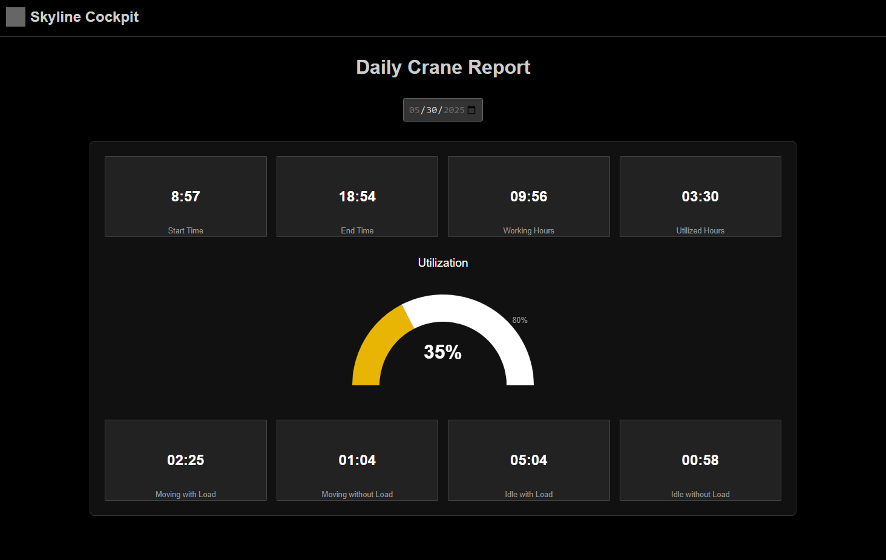
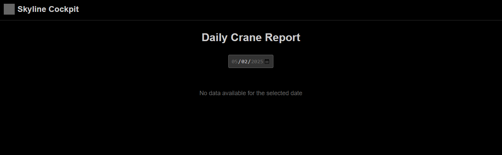

# Crane Activity Dashboard

## Design & Tech decisions
1. Native web components are leveraged for UI encapsulation and organization, while keeping simplicity of vanila/non-frameworks dependency.
2. NodeJS & Express.JS are choosen for my skill set. While it makes sense to use Node as an api/presentation level, it might not fit the logical calculations introduced while generating the report.
3. Most of the aggregation is done in the database, only top level summations are left to the web server.
4. The daily report data query encapsulate potentiall bad performance, although the date indexing is helpful. We can start with this online query (for time-to-market considerations, etc.). However, as the raw data set become more large at scale, I suggest to aggregare the report offline, with a map-reduce pattern. In such case the aggregated data shall reside in a document database.
5. IoC and layer sepataion (BL, DAL, etc.) for improved separation of conerns and maintainability

## Getting Started

### Prerequisites
- Node.js (targeted for v22 but should work for v16 or higher)
- npm

### Installation & Setup

1. **Clone the repository**
   ```bash
   git clone <repository-url>
   cd crane-activity
   ```

2. **Install API dependencies**
   ```bash
   cd api
   npm install
   ```

3. **Seed the database**
   ```bash
   npm run seed
   ```

4. **Start the API server**
   ```bash
   npm start
   ```
   The API will be available at `http://localhost:3000`

5. **Open the dashboard**
   Open `www/index.html` in your browser or serve it with a local web server:
   ```bash
   # Option 1: Direct file access
   open www/index.html
   
   # Option 2: Using Node.js http-server
   npx http-server www -p 8080
   # Then visit http://localhost:8080
   ```

### Usage
- Select a date from the date picker to view crane activity reports
- The dashboard shows daily statistics and activity breakdown
- Only dates with available data can generate reports

## Screenshots




